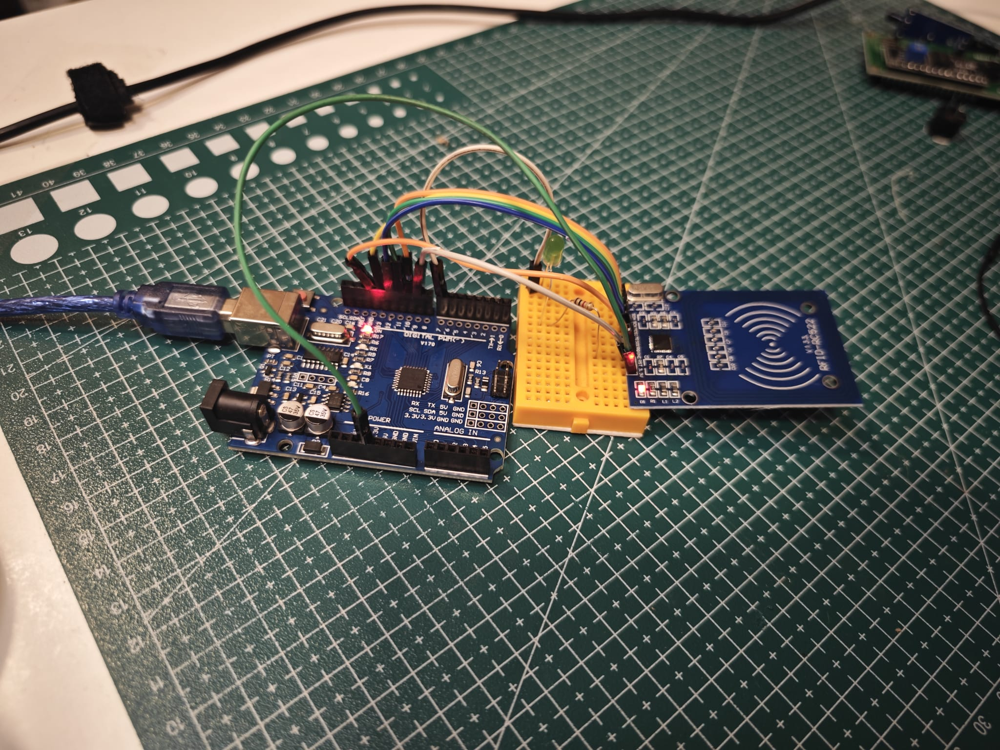
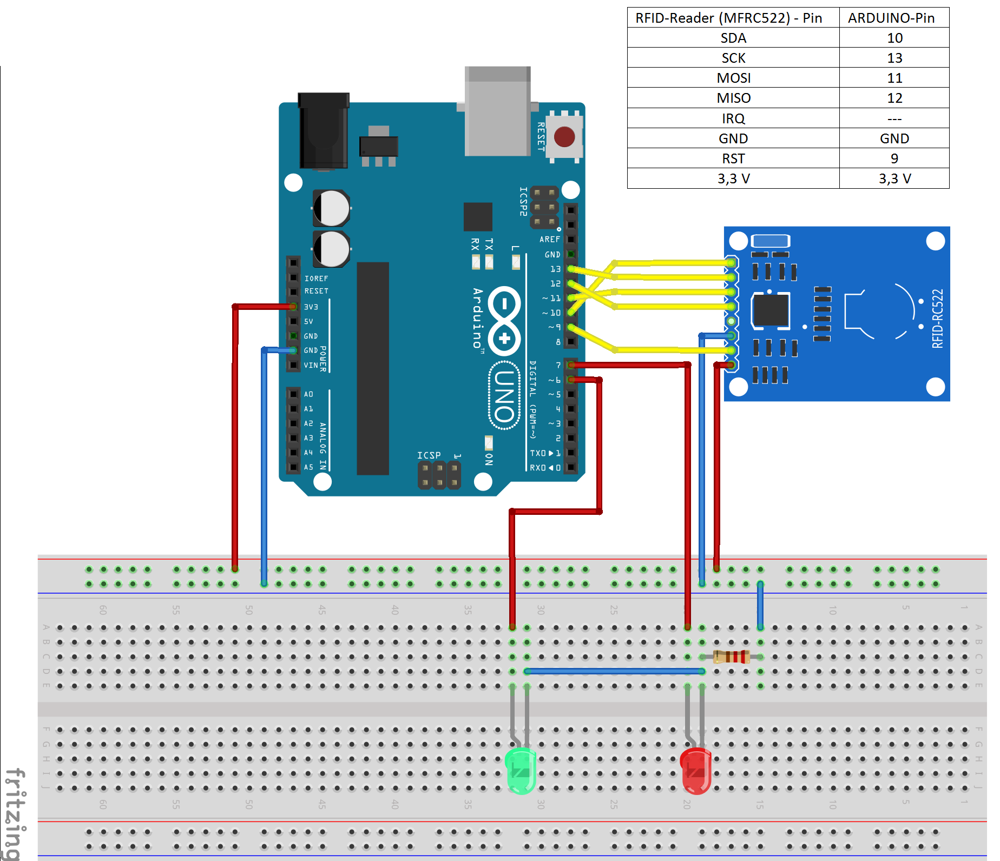

# Arduino ile RFID Kart Kontrollü LED Projesi

Bu projede Arduino UNO ve RC522 RFID modül kullanılarak kayıtlı kart okutulduğunda LED'in yanması sağlanır.

RFID kart veya anahtarlık okutulduğunda Arduino kartın UID değerini okur. UID değeri kod içerisinde kayıtlı yetkili kart ile eşleşirse LED yanar. Yetkisiz kart okutulduğunda LED yanmaz.

---

## Proje Görseli



---

## Bu Projede Ne Öğrenilir?

- RC522 RFID modül bağlantısı
- RFID kart UID değeri okuma
- Kayıtlı kart kontrolü
- Arduino ile LED yakma
- `MFRC522` kütüphanesi kullanımı
- SPI haberleşme mantığına giriş

---

## Gerekli Malzemeler


| Malzeme | Adet | Açıklama | Ürün Linki | Blog Linki |
|---|---:|---|---|---|
| Arduino UNO R3 Klon | 1 | Ana kontrol kartı | [Ürün](https://robomer.com/arduino-uno-r3-klon-usb-kablo-hediyeli-usb-chip-ch340) | [Arduino UNO R3 Klon Nedir?](https://robomer.com/blog/arduino-uno-r3-nedir) |
| RC522 RFID Modül | 1 | Kart ve anahtarlık okuma işlemi için kullanılır | [Ürün ](https://robomer.com/robomer-rc522-nfc-rfid-anahtarlik-ve-kart-seti-1356-mhz) | [MFRC522 / RC522 RFID Modül Nedir?](https://robomer.com/blog/mfrc522-nedir-nasil-calisir-arduino-ile-rfid-kart-okuyucu-kullanimi) |
| RFID Kart / Anahtarlık | 1+ | Yetkili giriş için kullanılır | Set içeriği | [RFID Kart Okuyucu Kullanımı](https://robomer.com/blog/mfrc522-nedir-nasil-calisir-arduino-ile-rfid-kart-okuyucu-kullanimi) |
| LED | 1 | Doğru kart okutulduğunda yanar | [Ürün](https://robomer.com/5mm-kirmizi-led-10-adet) 
| 1K Direnç | 1 | LED akımını sınırlandırır | [Ürün](https://robomer.com/1-4w-1k-direnc-paketi---10-adet) 
| Breadboard | 1 | Devreyi lehim yapmadan kurmak için kullanılır | [Ürün](https://robomer.com/orta-boy-breadboard-400-pin) 
| Jumper Kablo | Birkaç adet | Arduino, RC522 modül, LED ve breadboard bağlantıları için kullanılır | [Ürün](https://robomer.com/40-adet-erkek-disi-jumper-kablo-20cm) 

## Devre Bağlantısı

### RC522 RFID Modül

| RC522 Pini | Arduino UNO |
|---|---|
| SDA / SS | D10 |
| SCK | D13 |
| MOSI | D11 |
| MISO | D12 |
| RST | D9 |
| 3.3V | 3.3V |
| GND | GND |

> RC522 RFID modül 3.3V ile beslenmelidir. 5V besleme kullanmayın.

### LED Bağlantısı

| LED | Arduino UNO |
|---|---|
| LED uzun bacak | 1K direnç üzerinden D7 |
| LED kısa bacak | GND |

---

## Devre Şeması



---

## Arduino Kodları

| Dosya | Açıklama |
|---|---|
| `src/rfid_kart_ile_led_kontrolu/rfid_kart_ile_led_kontrolu.ino` | Kayıtlı kart okutulduğunda LED yakar. |
| `examples/rfid_uid_okuyucu/rfid_uid_okuyucu.ino` | Kart UID değerini öğrenmek için kullanılır. |

---

## Kart UID Nasıl Ayarlanır?

Önce UID okuyucu kodunu yükleyin:

```text
examples/rfid_uid_okuyucu/rfid_uid_okuyucu.ino
```

Arduino IDE Seri Monitör ekranını açın ve kartınızı okutun.

Ekranda görünen UID değerini ana koddaki şu bölüme yazın:

```cpp
byte authorizedUIDs[][4] = {
  {0xDE, 0xAD, 0xBE, 0xEF}
};
```

---

## Blog ve GitHub

- Blog: [https://robomer.com/blog/arduino-ile-rfid-kart-kontrollu-led-projesi](https://robomer.com/blog/arduino-ile-rfid-kart-kontrollu-led)
- GitHub: [https://github.com/Robomer-com/arduino-rfid-kart-ile-led-kontrolu](https://github.com/Robomer-com/arduino-rfid-kart-ile-led-kontrolu)

---

## Robomer

Bu proje Robomer Gelişmiş Başlangıç Seti ile uygulanabilir:

[Robomer Gelişmiş Başlangıç Setini İncele](https://robomer.com/robomer-gelismis-baslangic-seti)
